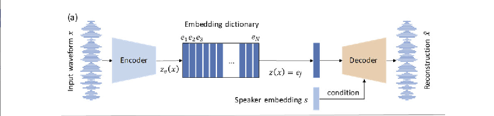

# TechnoGen: An AI Techno Music Generator

> Author: `Anton Lechuga` <br>
> Project Type: `Beat the classics | Bring your own data` <br>
> Domain `Audio Processing | Music Generation`

The goal is to build a model that that generates Electronic Dance Music (EDM) indistinguishable from human creators.
In order to limit the scope of the project, I decided to concentrate on the subgeneres of
[Industrial](https://en.wikipedia.org/wiki/Industrial_techno) and/or [Acid](https://en.wikipedia.org/wiki/Acid_techno) Techno, which are very similar in structure, melody and rhythm.

This project is a part of the course 'Applied Deep Learning' at the Technical University Vienna,
in which I want to investigate to what degree it is possible to downscale current state of the art
architecture.

> [!NOTE]<br>
> The chosen procedure greatly differs from my initial plans. Some of the major changes are:
> 1. Using raw audio data as input (good *MIDI* data was difficult to obtain)
> 2. Using Vector Quantized Variational Autoencoder vor generating music embeddings (enormous input sizes with raw audio)

## Table of contents

- [1. Usage](#1-usage)
- [2. Approach](#2-appraoch)
  - [2.1 Dataset](#-dataset)
  - [2.2 Model](#-model)
- [3. Training & Results](#3-training-and-results)
- [4. Planned Extensions](#3-results)


## 1. Usage
Installation of the required dependencies using *Python 3.9* onwards with

```bash
pip install -r requirements.txt
```

The codebase in designed for training of a model end-to-end after specifying the directory with the audio file location.

For running the training loop, run:
```bash
python3 training/train.py --config config/<config_name>.yml
```


## 2. Appraoch

WHAT DID I CHANGE 

#### Dataset
> [!WARNING]<br>
> File sizes can grow very quickly when working with hight quality audio data! 

While I trained my model on freely available techno tracks downloaded from [Soundcloud](https://soundcloud.com/discover), the pipeline also works on any other audio data which is why I will explain the procedure more generally in the following.

```
├── 📂 dataset
│   ├── 📂 data
│   │   ├── 📜 techo_<sample_rate>.h5
│   │   │   ...
│   ├── 📜 data_generator.py
│   ├── 📜 data_handler.py
│   └── 📜 file_processor.py
```

The pipeline is designed to work on any audio data, currently supported file types are `.wav` and `.mp3` extensions. From all audio files found in a specified directory, all files will be sliced and stored automatically within the `/data` folder where the data handlers operate on (see section 3 for more details ). Classes in `data_handler` are implemented to bridge between the stored data and the pytorch data operators defined in `data_processor` which handle all relevant functionalities needed for preparing the input for training a model. 

One major difficulty was to compromise between file sizes and data quality, as good quality audio data in `.wav` form quickly goes to gigabytes when training on many songs. Until now, I chose quality over quantity and only used good quality audio at high sample rates at **44 100 kHz** and each training sample had a length of **8 seconds**. However, these preprocessing steps are fully automated and can quickly be adjusted during training. The file handler will the search if a file already exists for the specifications and will generate a new data file if not.

#### Model

I implemented a Vector Quantized Variational Autoencoder (VQVAE) in pytorch inspired by [1] and [2] in order to reduce the dimensionality of input. The implementation is done similar to the shown graph in [3] where I added some residual blocks in both, the encoder and decoder block to ensure information flow. The embedding dictionary (bottleneck) in implemented in `vectorQuantizer` where no gradients pass through. During training, model parameters are stored in the `parameters` directory. Losses are also directly implemented into the model.

```
├── 📂 model
│   ├── 📂 vqvae
│   │   ├── 📜 vqvae.py
│   │   ├── 📜 resid.py
│   │   ├── 📜 encoder.py
│   │   ├── 📜 decoder.py
│   │   ├── 📜 vectorQuantizer.py
│   │   ├── 📂 parameter
│   │   │   ├── 📜 <model_name>.pth

```

## 3. Training and Results
> [!NOTE]<br>
> 1. At the time of the submission, I still wanted to test out some other configurations which is why the setup is still focussed on training models with various configurations of data splits and model/training configurations. When fixed, constant parts of the configuration will be directed to its corresponding folders in data/training/model.
> 2. In order to run the training, I used `wandb` for logging. When first running the training, you will be asked to sign in to wandb and create a (free) account.

All already illustrated in the first section, all operations needed for training can be directly asses during training. I therefore organized all needed information about data, training and model parameters in a hierarchical configuration file until a final model is found. While training, I initially targeted to be able to generate music directly from the model which I wasn't able to successfully deploy until now. 

#### Metrics
Hence, for this milestone I will use the defined loss and its components to asses the quality of my model, which alternatively can also be used for generating music embeddings as input for auto-regressive models such as transformer-based architectures. For this model, the loss is defined by a weighted some of three different components where the weights themselves are hyperparameters:

$$L=L_{reconstruction}+L_{codebook}+L_{commit}$$

Hereby, the reconstruction loss is further divided into two terms assessing a one-dimensional difference between the input and reconstruction on the one hand and a spectral difference of their spectrograms on the other hand. Since the codebook loss measures the difference between the encoded sound and the codebook vectors, it is also an important measure to keep track of as average closeness between both vectors might be an indicator for better ability to generate sounds as well. Hence, during training I kept track of all the metrics mentioned in this paragraph.

For the task at hand, my simple baseline had many problems with vanishing or exploding gradients barely getting under a validation set loss of $1$. Hence, my inital goal was set two-folded:
  1. Quantitave Assesment: $L<0.25$
  2. Qualitative Assesment: Reconstruction is subjectively close to input audio
  3. *Bonus*: Generating something what can be considered sound from codebook vectors

#### Results 


## Time Plan

The time plan consists of several stages, where the building & fine-tuning of the model are expected
to be the most time consuming tasks. Note that I plan to include considerations about the final report
and the presentation in each part of the other stages. As I am further quite new to the topic of audio processing
and music generation in particular, I expect the project to be a lot more time consuming as indicated by the
ECTS, which is however a circumstance I am willing to take.

| Task | Hours | Deadline |
| --- | --- | --- |
| dataset collection | 15 | 31.10.2023 |
| Model Design & Building| > 25  | 25.11.2023 |
| Training & Fine-Tuning| > 25 | 15.12.2023 |
| Application Building| 10 | 10.01.2024 |
| Final Report | 5 | 15.01.2024 |
| Presentation Preparation| 5 | 15.01.2024 |

## References

[1] Dhariwal, P., Jun, H., Payne, C., Kim, J. W., Radford, A., & Sutskever, I. (2020). Jukebox: A generative model for music. arXiv preprint arXiv:2005.00341.

[2] Défossez, A., Copet, J., Synnaeve, G., & Adi, Y. (2022). High fidelity neural audio compression. arXiv preprint arXiv:2210.13438.

[3] Ding, S., & Gutierrez-Osuna, R. (2019, September). Group Latent Embedding for Vector Quantized Variational Autoencoder in Non-Parallel Voice Conversion. In Interspeech (pp. 724-728).